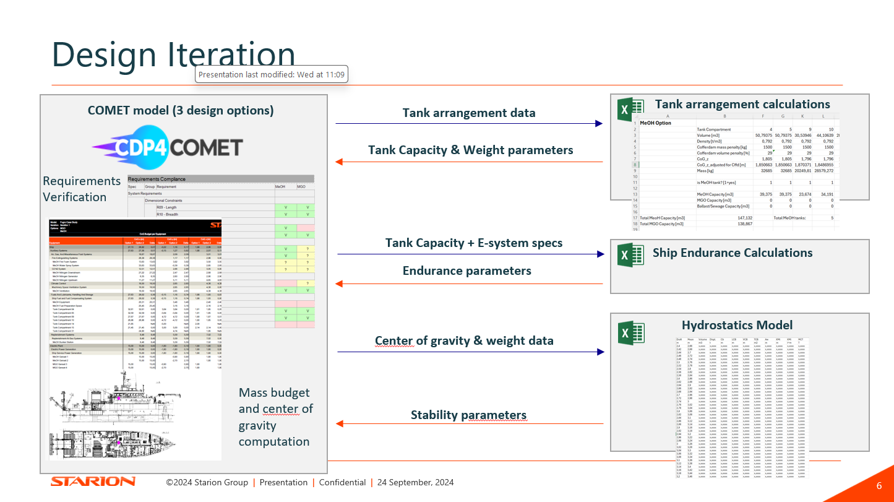

# Introduction

The ‘Model - Ship Conversion to Methanol’ is a CDP4-COMET model that is developed for a ship conversion project with the goal of converting a ship that was originally powered by 4 diesel generators to a ship that is powered by 2 methanol generators and 2 diesel generators.

# Model Architecture

The Model’s architecture is based on the Ship Work Breakdown Structure (SWBS) and describes the following elements within this SWBS in detail:
-	The tank arrangement (including fuel- & ballast tanks, cofferdams and working spaces)
-	Additional equipment required for methanol usage
-	The possible gensets for the ships power generation

The rest of the ship’s architecture is assumed to be fixed and is therefore modelled as a fixed mass and centre of gravity element.
In the current state of this model. 3 design options are configured:
-	The original ship configuration powered by 4 diesel generators
-	A ship conversion configuration, replacing 2 out of the 4 original gensets by methanol generators
-	A ship configuration powered by 4 methanol generators

# Analysis Models

Lastly, the model’s domain file store contains both, an Excel that can compute the necessary tank arrangement, ship endurance and ship stability parameters through the Excel-plugin, and a mass-/centre of gravity report that can compute the total mass and centre of gravity of all higher level ship systems. These parameters are linked to the requirements specification that is also included in this model. This will allow the user to automatically verify whether a defined design option fulfils the specified requirements (e.g. in terms of ship stability or endurance).

The design flow to use the model, the reports and the excel analysis model is depicted in the image below:

The following analysis tools/reports are included:

  - [Tank arrangement Analysis](./Analysis/Public_Ship_Conversion_Model_Calculations.xlsx)
  - [CoG Report](./Analysis/CoGBudgetEquipment_mass.rep4)
  - [Mass Budget Report](./Analysis/MassBudgetEquipment_mass.rep4)
  - [Requirements Compliance Report](./Analysis/Requirements_OptionDependent_2_1.rep4)